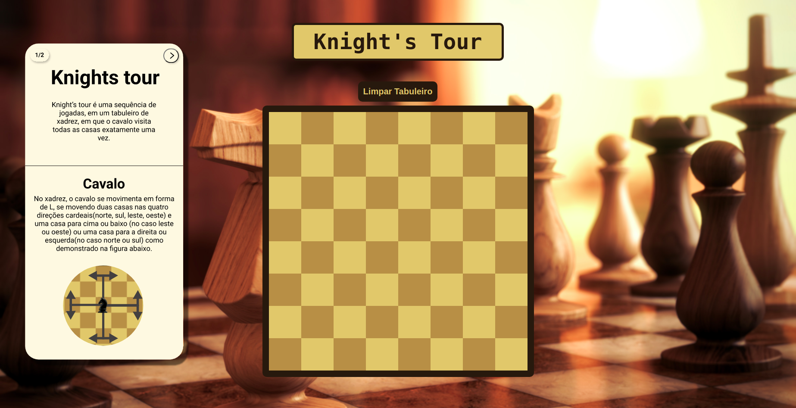
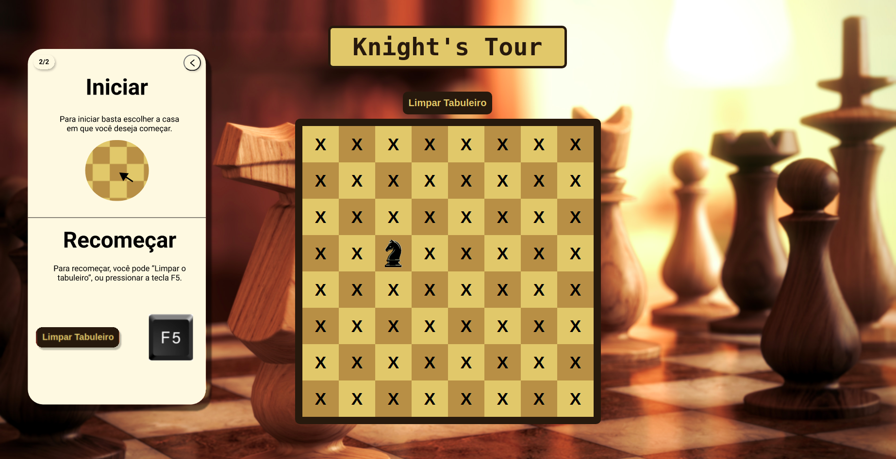

# Knight’s Tour 

**Número da Lista**: 02 
**Conteúdo da Disciplina**: Grafos 1 

## Alunos
|Matrícula | Aluno |
| -- | -- |
| 17/0080102  |  Lucas Gomes Lopes |
| 19/0106565  |  Fernando Miranda Calil |

## Sobre 
O projeto visa solucionar o Problema do Cavalo (também conhecido como Knight's Tour), que é um problema matemático envolvendo o movimento da peça do cavalo no tabuleiro de xadrez. O problema consiste em colocar a peça do cavalo em qualquer casa do tabuleiro e mover a peça para as 63 casas restantes sem jamais passar pela mesma casa mais de uma vez.

## Screenshots

Página Inicial:

Algoritmo em funcionamento:

Página após a execução correta do algoritmo:

## Instalação 
**Linguagem**: Java Script 

Para poder rodar o projeto, você deve possuir um browser de internet instalado no seu computador.

## Acesso

**O projeto pode ser acessado através do link:**

[Grafos 1 - Knight's Tour](https://grafos1knightstour.s3.sa-east-1.amazonaws.com/index.html)

**Caso preferir rodar o projeto de forma local:**

1- Ir até o diretório que deseja colocar os arquivos:

>   cd caminho-para-diretotio

2- Fazer download do projeto:

>   git clone git@github.com:projeto-de-algoritmos/Grafos1_KnightsTour.git

3- Abrir o arquivo index.html utilizando o seu browser preferido.

## Uso 
Uma vez que a página esteja aberta, basta escolher uma das casas do tabuleiro, onde o cavalo irá começar, e o algoritmo deverá preencher todas as casas.
Para reiniciar o algoritmo você poderá fazer isso de duas formas, ou atualizando a página com a tecla F5, ou utilizando o botão "Limpar tabuleiro" disponibilizado acima do tabuleiro na página.

## Outros 
Quaisquer outras informações sobre seu projeto podem ser descritas abaixo.

